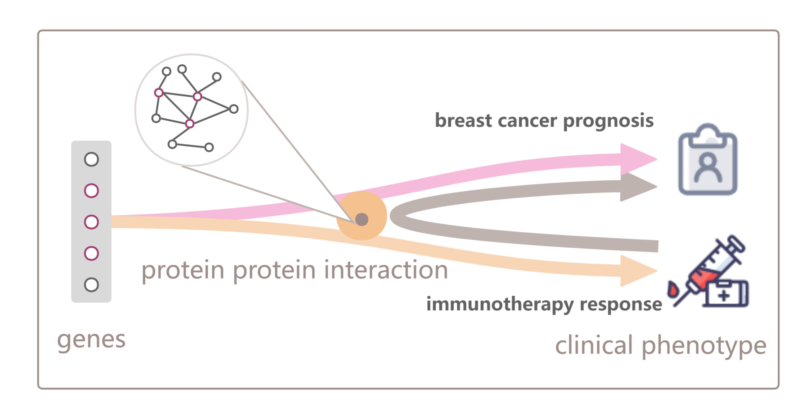
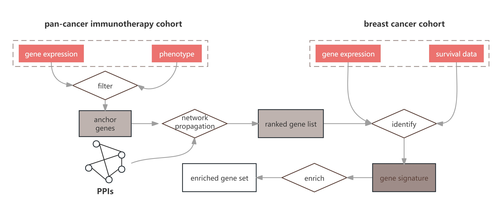

# NBT

A new perspective on transferring pan-cancer immunotherapy responses to guide breast cancer prognosis was introduced, providing deeper insights into tumor homogeneity. The protein-protein interaction network was utilized to bridge the genes and clinical phenotypes. A network-based method was proposed to support the identification of gene signatures for breast cancer prognosis based on immunotherapy responses. 

This repository provides the code and data for network-based transfer across clinical phenotypes. The figure illustrates the detailed workflow for the identification of gene signatures. The dotted-line module represents the input data originating from various cancer studies.

